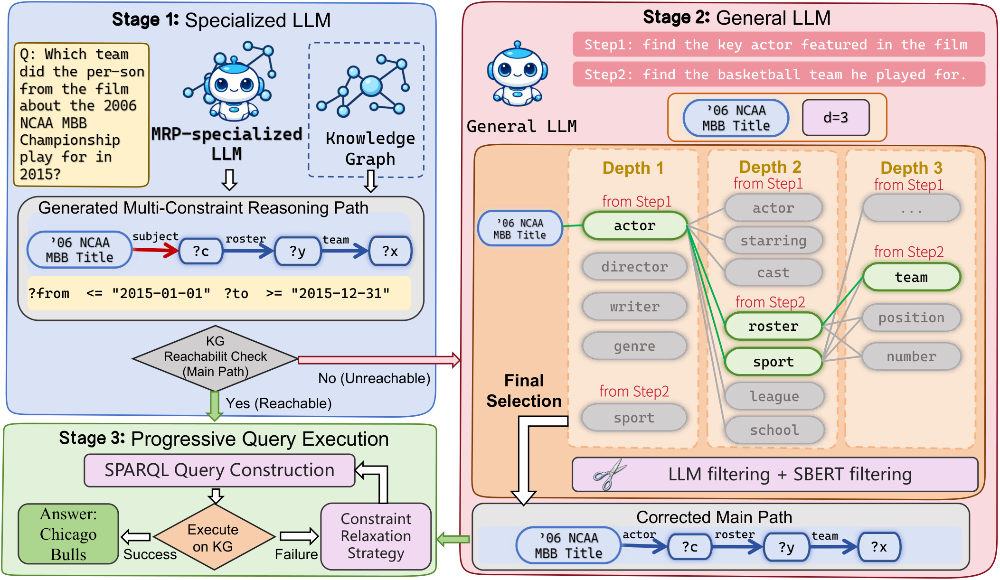

# RouterKGQA

Official code for **"RouterKGQA: Specialized--General Model Routing for Constraint-Aware Knowledge Graph Question Answering"**.

## Overview



## General Setup

### Environment Setup
```
conda create -n routerkgqa python=3.12
conda activate routerkgqa
pip install -r requirements.txt
```

### Freebase KG Setup

Below steps are according to [Freebase Virtuoso Setup](https://github.com/dki-lab/Freebase-Setup).

#### How to install virtuoso backend for Freebase KG.

1. Clone from `dki-lab/Freebase-Setup`:
```
cd Freebase-Setup
```

2. Processed [Freebase](https://developers.google.com/freebase) Virtuoso DB file can be downloaded from [Dropbox](https://www.dropbox.com/s/q38g0fwx1a3lz8q/virtuoso_db.zip) or [Baidu Netdisk](https://pan.baidu.com/s/1F0ytk74p8PGQ0tgAMu9--g?pwd=cp1j) (WARNING: 53G+ disk space is needed):
```
tar -zxvf virtuoso_db.zip
```

3. Managing the Virtuoso service:

To start service at `localhost:3001/sparql`:
```
python3 virtuoso.py start 3001 -d virtuoso_db
```

and to stop a currently running service at the same port:
```
python3 virtuoso.py stop 3001
```

A server with at least 100 GB RAM is recommended.

#### Download FACC1 mentions for Entity Retrieval.

- Download the mention information (including processed [FACC1](https://github.com/HXX97/GMT-KBQA/blob/main/data/common_data/facc1/README.md) mentions and all entity alias in Freebase) from [OneDrive](https://1drv.ms/u/s!AuJiG47gLqTznjl7VbnOESK6qPW2?e=HDy2Ye) or [Baidu Netdisk](https://pan.baidu.com/s/1qbKP2DV1lo9jlYoBxpyTHA?pwd=qzb7) to `data/common_data/facc1/`.

```
RouterKGQA/
└── data/
    ├── common_data/
        ├── facc1/
            ├── entity_list_file_freebase_complete_all_mention
            └── surface_map_file_freebase_complete_all_mention
```

## Dataset

Experiments are conducted on 2 KBQA benchmarks: WebQSP and CWQ.

### WebQSP

[WebQSP](https://www.microsoft.com/en-us/research/publication/the-value-of-semantic-parse-labeling-for-knowledge-base-question-answering-2/) dataset should be downloaded under `data/WebQSP/origin`.

```
RouterKGQA/
└── data/
    ├── WebQSP/
        ├── origin/
            ├── WebQSP.train.json
            └── WebQSP.test.json
```

### CWQ

[CWQ](https://www.dropbox.com/sh/7pkwkrfnwqhsnpo/AACuu4v3YNkhirzBOeeaHYala) dataset should be downloaded under `data/CWQ/origin`.

```
RouterKGQA/
└── data/
    ├── CWQ/
        ├── origin/
            ├── ComplexWebQuestions_train.json
            ├── ComplexWebQuestions_dev.json
            └── ComplexWebQuestions_test.json
```

### Data Processing: SPARQL to CRP

We convert SPARQL annotations into Constraint-aware Reasoning Paths (CRPs) for training and evaluation:

```bash
python data_process/sparql_to_crp.py
```

The processed training data in LLaMA-Factory format is provided under `data/`:

```
RouterKGQA/
└── data/
    ├── dataset_info.json
    ├── WebQSP_train/
    │   └── examples.json
    ├── WebQSP_test/
    │   └── examples.json
    ├── CWQ_train/
    │   └── examples.json
    └── CWQ_test/
        └── examples.json
```

## Fine-tuning, Repair and Evaluation

### Stage 1: CRP Generation (Specialized Model)

We fine-tune the specialized model using [LLaMA-Factory](https://github.com/hiyouga/LLaMA-Factory) with LoRA. Please refer to the paper (Appendix D) for detailed training hyperparameters. WebQSP and CWQ models are trained separately.

Pre-trained LoRA adapters for Llama-3.1-8B fine-tuned on each dataset:

| Dataset | Backbone | Checkpoint |
|---|---|---|
| WebQSP | Llama-3.1-8B-Instruct | `checkpoints/webqsp_llama31_8b/` |
| CWQ | Llama-3.1-8B-Instruct | `checkpoints/cwq_llama31_8b/` |

Generate CRPs using the fine-tuned specialized model with beam search:

- WebQSP:

```bash
python stage1_crp_generation/predict.py \
  --model_path meta-llama/Llama-3.1-8B-Instruct \
  --adapter_path checkpoints/webqsp_llama31_8b \
  --dataset_path data/WebQSP_test/examples.json \
  --output_file results/webqsp_predictions.json \
  --num_beams 15 \
  --num_return_sequences 15 \
  --template llama3
```

- CWQ:

```bash
python stage1_crp_generation/predict.py \
  --model_path meta-llama/Llama-3.1-8B-Instruct \
  --adapter_path checkpoints/cwq_llama31_8b \
  --dataset_path data/CWQ_test/examples.json \
  --output_file results/cwq_predictions.json \
  --num_beams 15 \
  --num_return_sequences 15 \
  --template llama3
```

### Stage 2: Path Repair (General Model)

When the specialized model's main path is unreachable on the KG, Stage 2 repairs it via LLM-guided beam search over relations.

- WebQSP:

```bash
python stage2_path_repair/repair.py \
  --input results/webqsp_predictions.json \
  --output_dir results/webqsp_repaired \
  --llm_type gpt-4o-mini \
  --api_key $OPENAI_API_KEY \
  --k 4 --m 10
```

- CWQ:

```bash
python stage2_path_repair/repair.py \
  --input results/cwq_predictions.json \
  --output_dir results/cwq_repaired \
  --llm_type gpt-4o-mini \
  --api_key $OPENAI_API_KEY \
  --k 4 --m 10
```

### Stage 3: Evaluation

The evaluation script handles CRP-to-SPARQL conversion, progressive constraint relaxation, and computes Hits@1 and F1.

- WebQSP:

```bash
python evaluate.py \
  --dataset WebQSP \
  --pred_file results/webqsp_repaired/predictions.json \
  --split test \
  --golden_ent
```

- CWQ:

```bash
python evaluate.py \
  --dataset CWQ \
  --pred_file results/cwq_repaired/predictions.json \
  --split test \
  --golden_ent
```

## BibTex

If you find this work is helpful for your research, please cite:

```bibtex
@inproceedings{routerkgqa2025,
    title = "{R}outer{KGQA}: Specialized--General Model Routing for Constraint-Aware Knowledge Graph Question Answering",
    author = "Anonymous",
    booktitle = "Proceedings of the Association for Computational Linguistics",
    year = "2025",
}
```

## Acknowledgement

This repo benefits from [LLaMA-Factory](https://github.com/hiyouga/LLaMA-Factory) and [Freebase-Setup](https://github.com/dki-lab/Freebase-Setup). Thanks for their wonderful works.
